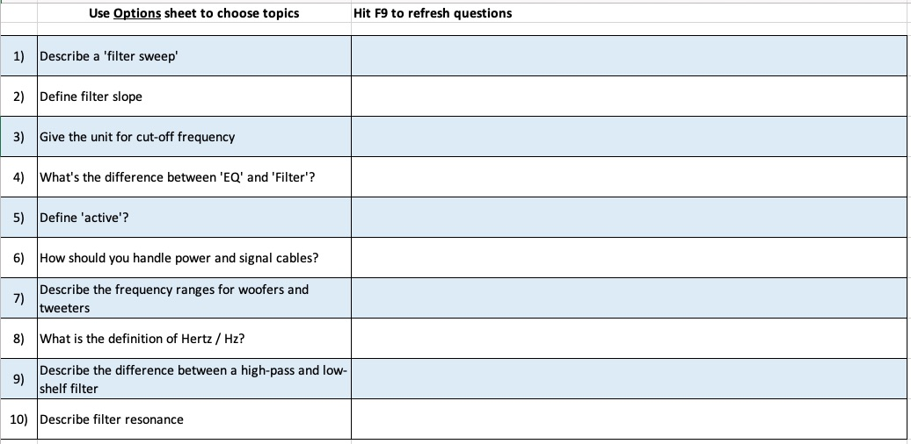
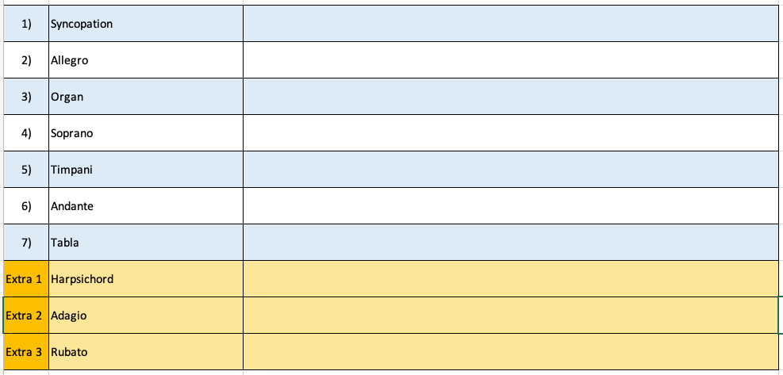

# Excel tools
{: .no_toc}

- TOC
{:toc}

## Retrieval Roulette

The roulette is a bank of questions used to automatically construct a random quiz. 

It supports retrieval practice and spaced repetition: questions from previous and current topics are mixed up randomly (at your control).

The model is simple and flexible.

* **Questions** sheet holds all the questions and answers
* **Options** sheet selects which topics to include
* The following sheets quiz in both directions
* **Print Q** sheet designed to fill A4 paper for homework or test

For more information about roulettes, see [Adam Boxer's blog](https://achemicalorthodoxy.wordpress.com/2018/08/18/retrieval-roulettes/). Links to many different examples at the bottom.

### Instructions

Written and video instructions to follow.

## MCQ Machine

The MCQ machine generates five multiple-choice questions from a list. You turn individual questions on or off in the **Questions** sheet and Excel will randomly choose five. The order of the responses are also randomised.

### Instructions

1. Type a new question and up to four responses. Correct answer goes in final column. If not spelled identically, this will fail.
2. Type Y to include that row in the pool of possible questions.
3. You can leave rows blank or add headings to organise topics/weeks etc.
4. Select a number of the yellow cells, then press Ctrl+Enter to type 'Y' into many cells at once (for example to select questions for an entire topic).

Thoughts on writing [high-quality MCQs](https://testing.byu.edu/handbooks/14%20Rules%20for%20Writing%20Multiple-Choice%20Questions.pdf).

## Extensible Exercise

An adaptation to a Roulette based on single-word KS4 glossary.

In the **Glossary** sheet, toggle single terms on and off with 'Y'.

Optional 'extra' questions can be specified with 'X'. These appear as the final 3 questions of a 10-question quiz.

